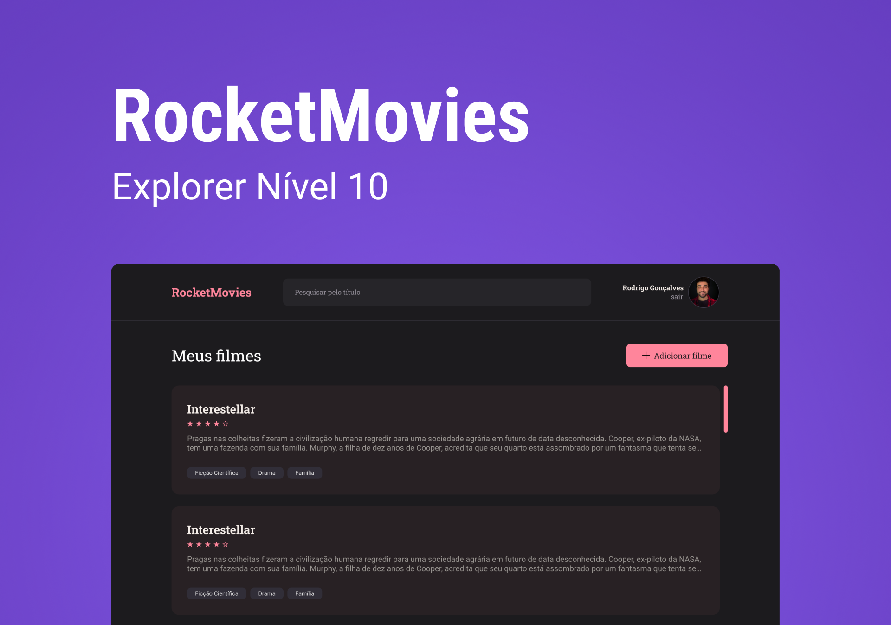

<h1>RocketMovies</h1>

 

<h2> O Projeto </h2>

O projeto foi desenvolvido como desafio do curso Explorer da Rocketseat e segue a mesma ideia do projeto rocketNotes, porem agora, a aplicação é voltada para guardar e avaliar seus filmes favoritos.

 

informações básicas que o usuário deve seguir para usar o RocketMovies:

- Funcionalidades da aplicação:
  - Cadastra os usuários;
    - Somente usuários cadastrados podem fazer login na aplicação;
  - Dentro da plataforma é possível alterar:
    - foto do avatar de usuário
    - dados de acesso do usuário
  - Cria e exclui notas dos filmes;
  - Adiciona tags para os filmes;
  - Adiciona avaliação (0 -5) para os filmes;
  - Permite fazer busca pelas notas criadas através de:
    - título
    - palavras-chave relacionadas
    - abreviações
    - tags

 

- Funcionalidades dos botões:
  - Camera: permite a alteração do avatar do usuário;
  - Adicionar filme: leva para a tela de criar anotação sobre o filme;
  - +: adiciona tag;
  - x: remove tag;
  - Salvar: salva as anotações do filme;
  - Excluir: Exclui a anotação do filme;
  - Voltar: volta para a tela anterior;
  - Tags: seleciona as notas criadas pelo tema;
  - sair: sai da aplicação;

 

  

 

Quer conferir o RocketMovies? 

[Visite o projeto online](https://rocketfilmes.netlify.app/)

OBS: Será acrescentado melhorias.

 

<h2> O intuito do projeto </h2>

O intuito do projeto foi colocar em prática os conhecimentos acerca de:

- HTML
- CSS
- JavaScript
- NodeJS
- ReactJS
  - Vite
  - styled-components
  - React router dom
  - Axios
  - LocalStorage

 

<h2> Tecnologias </h2>

Foi utilizado as seguintes tecnologias para desenvolver esse projeto:

- HTML
- CSS
- JavaScript
- NodeJS
- ReactJS
- Git
- GitHub
- Figma